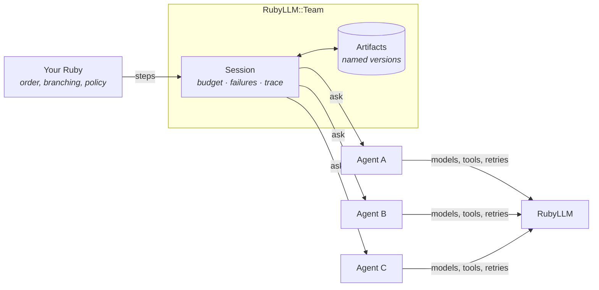
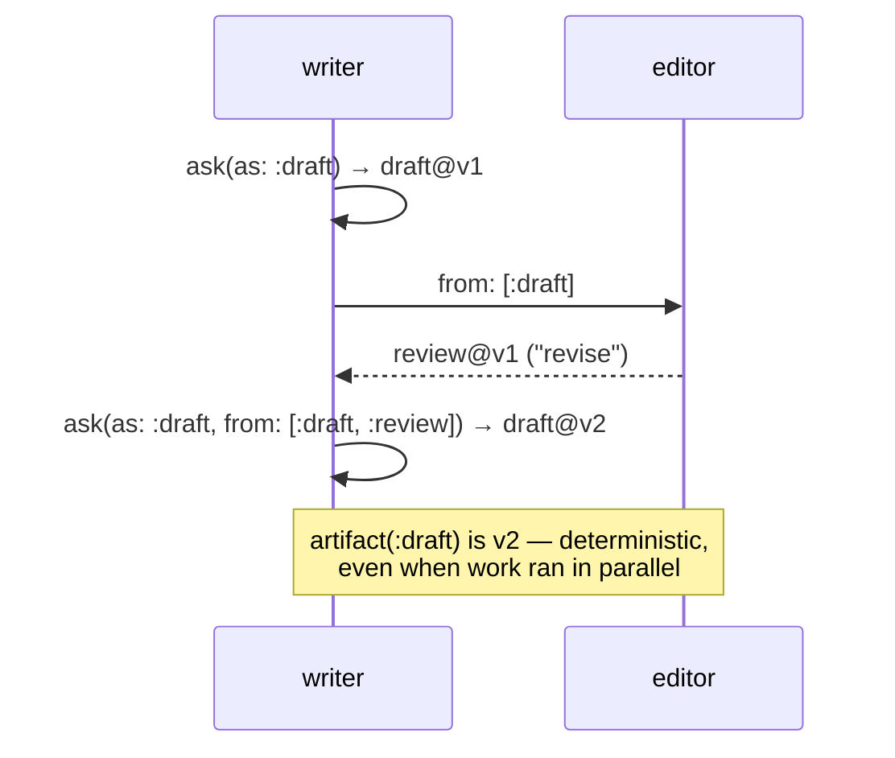

# RubyLLM::Team

**Several RubyLLM agents, one run you can audit.** Team gives a multi-agent workflow the
things you would otherwise hand-roll: named handoffs between agents, one call budget for the
whole run, safe fan-out, and a trace showing the exact prompt every agent received.

[](https://github.com/jetthoughts/ruby_llm-team/actions/workflows/ci.yml)
[](https://www.ruby-lang.org)
[](LICENSE.txt)

It is a small library, not a framework. Your workflow stays ordinary Ruby.

## Do I need this?

You do **not** need Team for one agent, or two agents in a straight line. `Agent#ask` is enough.

You start needing it at the point below — when several agents share work and you have to answer
"which version did the editor actually review?" and "why did this run cost 40 calls?"

| You are writing this by hand | Team gives you |
| --- | --- |
| A hash of results, plus rules for which version is "current" | Named artifact versions with explicit `as:` / `from:` handoffs |
| A counter so one runaway loop cannot bill you forever | One atomic call budget for the run, across threads and fibers, bounded by default |
| `Thread.new` per agent and a join that swallows one failure | Fan-out that settles every sibling before raising |
| `rescue => e` in six places, each shaped differently | One `CollaborationError`, plus typed `BudgetExceededError` |
| A logger you grep after something goes wrong | A trace with the exact prompt each agent received |

## Install

```ruby
gem 'ruby_llm-team', require: 'ruby_llm/team'
```

## Quickstart

```ruby
require 'ruby_llm/team'

team = RubyLLM::Team.new
                    .add(:planner, PlannerAgent)
                    .add(:reviewer, ReviewerAgent)

execution = team.run(max_calls: 4, context: 'Fix one failing test.') do |run|
  run.step :plan,   with: :planner,  prompt: 'Write a short implementation plan.'
  run.step :review, with: :reviewer, from: [:plan], prompt: 'Is this plan safe?'
  run.output :review
end

execution.output            # => the reviewer's answer
execution.value(:plan)      # => the plan the reviewer actually saw
puts execution.to_markdown  # => the full trace
```

A coworker is anything that responds to `#ask` — a `RubyLLM::Agent` class, an instance, or a
plain object. That is what makes offline tests trivial (see [Testing](#testing)).

Or hand the tools to a model and let it decide who to consult, with your budget as the limit:

```ruby
session = team.session(max_calls: 6)
chat    = RubyLLM.chat.with_tools(*session.tools)

chat.ask('Solid Queue or Sidekiq for a three-person team?')
session.calls.map(&:coworker)  # => whom the model actually chose to ask
```

## How it fits together



Team sits between your code and your agents. It never owns models, prompts, schemas, retries,
or your business rules.

## Handoffs are explicit

`as:` names an output. `from:` selects which named outputs the next coworker receives, verbatim.
Reusing a name publishes a new version, so a revision never silently overwrites its source.



```ruby
session.ask(:writer, 'Write the draft', as: :draft, from: [])
session.ask(:editor, 'Review it',       as: :review, from: [:draft])
session.ask(:writer, 'Revise it',       as: :draft,  from: %i[draft review])

session.artifact(:draft).version  # => 2
session.artifact(:draft).sources  # => ["draft@v1 (writer)", "review@v1 (editor)"]
```

## Running work in parallel

```ruby
reviews = session.parallel(
  { security: prompt, performance: prompt, style: prompt },
  concurrency: :threads   # or :fibers, using the optional async gem
)
```

Every task reserves budget up front and appears in the trace. There is deliberately no `limit:`
— bound concurrency where you own the task list:

```ruby
tasks.each_slice(3).flat_map { |batch| session.parallel(batch.to_h) }
```

## Quality loops stay in your Ruby

There is no `refine` or `repair` API. Compose the loop through `session.ask` and every round is
budget-accounted, traced, and failure-normalized because it is an ordinary call:

```ruby
session.ask(:writer, task, as: :draft, from: [])

3.times do
  review = session.ask(:critic, 'Review the draft.', as: :review, from: [:draft])
  break if review.fetch('verdict') == 'pass'

  session.ask(:writer, 'Revise using every finding.', as: :draft, from: %i[draft review])
end
```

Your code owns the predicate and the bound. Swap the critic for a validator and the same shape
becomes a repair loop.

## Traces

`to_markdown` renders the run for reading. `to_h` / `to_json` export it for tooling, including
per-call and run-total token usage:

```ruby
execution.to_h[:usage]   # => { input_tokens: 8_412, output_tokens: 3_120 }
execution.to_h[:calls]   # => structure, statuses, artifact lineage
execution.to_json(include_content: true)  # prompts and results, opt-in
```

Prompts and results are excluded unless you ask for them, so an exported trace is safe to ship.
The prompt recorded is the exact text the coworker received — context and handoffs included.

## Testing

Coworkers are plain objects, so most tests need no stubbing library and no API key:

```ruby
writer = Class.new { def ask(_prompt) = 'DRAFT' }
team   = RubyLLM::Team.new.add(:writer, writer)

execution = team.run { |run| run.step :draft, with: :writer }
expect(execution.value(:draft)).to eq('DRAFT')
```

For live workflows, record one VCR cassette and replay it in CI with no key —
[`spec/ruby_llm/code_review_workflow_spec.rb`](spec/ruby_llm/code_review_workflow_spec.rb)
shows both patterns side by side.

## Examples

**Copy from [`code_review/`](examples/code_review/) first** — 110 lines, and it shows the whole
library: parallel fan-out, named handoffs, budget, trace, and a verdict computed in Ruby rather
than trusted from a model.

| Example | Shape | Run it |
| --- | --- | --- |
| [`simple_team.rb`](examples/simple_team.rb) | Two coworkers, one handoff | `ruby examples/simple_team.rb` (no API key) |
| **[`code_review/`](examples/code_review/)** | **Fan-out / fan-in — start here** | `ruby examples/code_review/workflow.rb [diff]` |
| [`topic_analyst/`](examples/topic_analyst/) | Parallel research, ranked output | `ruby examples/topic_analyst/workflow.rb "Rails jobs"` |
| [`decision_panel/`](examples/decision_panel/) | **No Ruby orchestration** — a lead model picks whom to consult | `ruby examples/decision_panel/workflow.rb "your question"` |
| [`editorial_pipeline.rb`](examples/editorial_pipeline.rb) | Two teams composed in plain Ruby | `ruby examples/editorial_pipeline.rb "your domain"` |
| [`blog/`](examples/blog/) | _Advanced._ Seven editorial passes, bounded gates, escalation | `ruby examples/blog/workflow.rb` |

The blog example is production-scale on purpose and is the largest thing here; read it for
patterns, not as a starting point. Live examples need `OPENROUTER_API_KEY`; the research ones
also use `YDC_API_KEY`.

## What Team is not

No graph DSL, YAML workflows, or role/backstory metaphors. No memory, RAG, MCP, or search. No
dashboards, persistence, or scheduling — [`ruby_llm-agents`](https://github.com/adham90/ruby_llm-agents)
owns that Rails layer and Team composes inside it. No hidden retries or model selection: RubyLLM
owns those.

Reasoning and the evidence behind each refusal: [`docs/DECISIONS.md`](docs/DECISIONS.md).

## Development

```bash
bundle install
bundle exec rake spec          # the suite
bundle exec rake spec:replay   # recorded workflows, no API key needed
bundle exec rubocop
```

## License

MIT. See [LICENSE.txt](LICENSE.txt).
